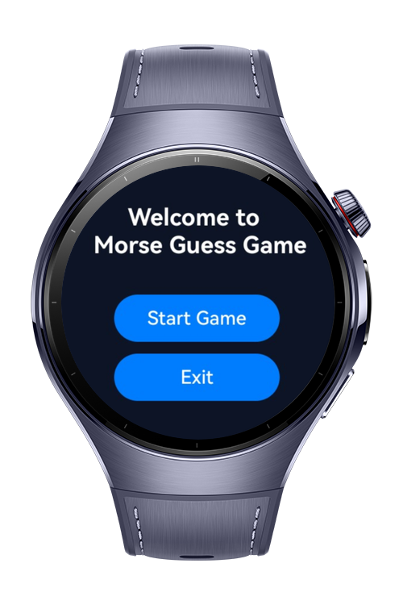
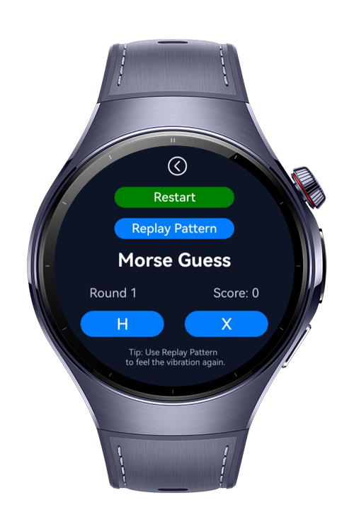
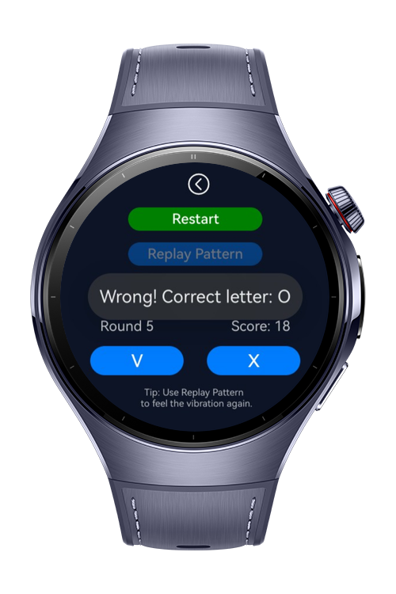
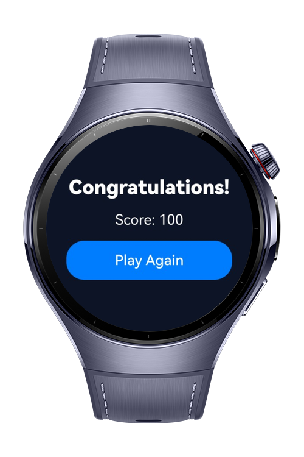

> **Note:** To access all shared projects, get information about environment setup, and view other guides, please visit [Explore-In-HMOS-Wearable Index](https://github.com/Explore-In-HMOS-Wearable/hmos-index).

# MorseGuard App

MorseGuard is a HarmonyOS-based wearable game designed for Huawei Watch 5.   Players guess letters represented by Morse code vibration patterns. Each correct guess increases their score, and reaching 100 points wins the game. The app uses haptic feedback, random letter generation, and simple gesture interaction to create an engaging learning experience.

# Preview

<div>
  
  
  
  
</div>


# Use Cases

- **Educational Game**: Learn and practice Morse code through interactive play.  
- **Cognitive Training**: Improve reaction time and memory by recognizing vibration patterns.  
- **Wearable Interaction Demo**: Showcases the use of haptics and motion sensors on HarmonyOS devices.  


# Technology

## Stack
**Languages**: ArkTS  
**Framework**: HarmonyOS SDK 5.1.0(16)
**Tools**: DevEco Studio Version 5.1.0.842
**Libraries/Kits**:  
  - Haptic Kit (vibration patterns)  
  - Sensor Kit (motion/accelerometer for shake-to-clear)  
  - AbilityKit & Router (page navigation)  
  - PromptAction (toast messages)  
  
  ## Required Permissions
  - `ohos.permission.ACCELEROMETER`  
  - `ohos.permission.ACTIVITY_MOTION`   
  - `ohos.permission.GYROSCOPE`
  - `ohos.permission.READ_HEALTH_DATA`

<br/>

# Directory Structure
```
MorseGuardApp/
├── pages/
│ ├── HomePage.ets                # Landing screen
│ ├── GamePage.ets                # Main gameplay (Morse vibration, scoring, letter choices)
│ ├── WinPage.ets                 # Win screen with final score and replay option
├── services/
│ ├── HapticService.ets           # Wrapper around vibrator APIs
│ ├── MorseEngine.ets             # Morse code dictionary and distractor logic
│ ├── PatternPlayer.ets           # Plays Morse patterns as haptic sequences
├── components/
│ └── DotDashPad.ets              # Optional practice pad for dot/dash input

```
<br/>


# Constraints and Restrictions

## Supported Device
- Huawei Watch 5


## License
**MorseGuard** is distributed under the terms of the **MIT License**.  
See the [LICENCE](/LICENCE) file for more information.


